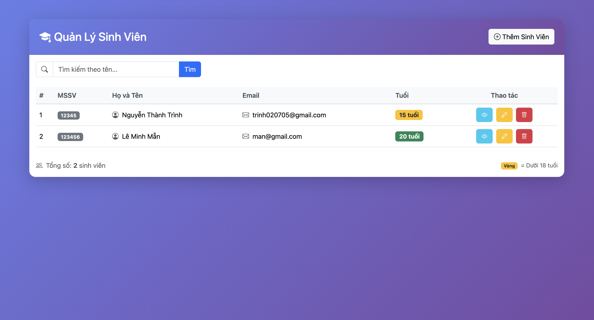
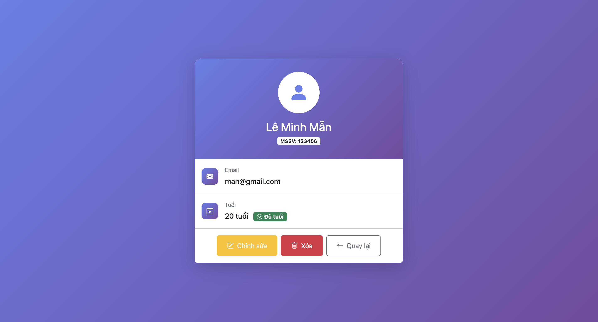
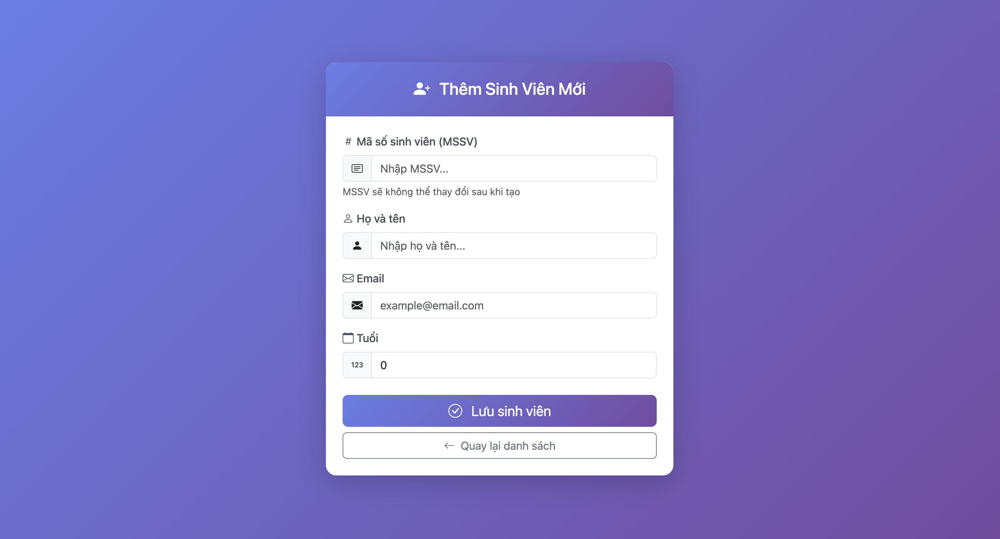
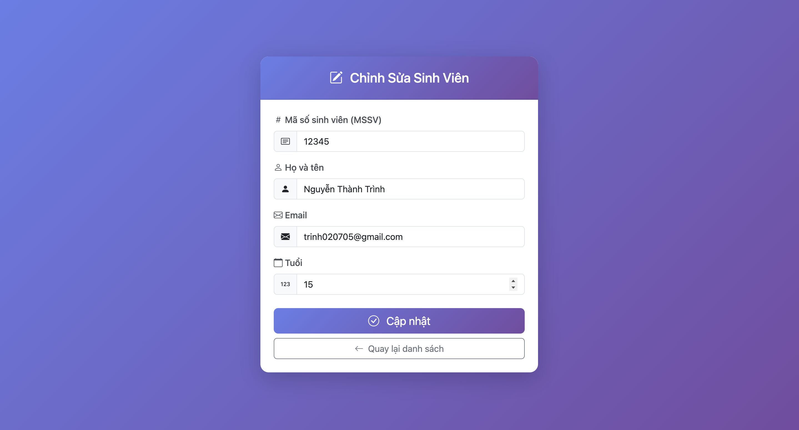

# Student Management System - Advanced Software Engineering
## 1. Danh sách nhóm 

- Thành viên 1: Nguyễn Thành Trình - 2313640

- Thành viên 2: Lê Minh Mẫn - 2312040

## 2. Public URL (Lab 5) 

Github Repo URL: https://github.com/NguyenThanhTrinh275/student-management
Web Service URL: https://student-management-1-uysi.onrender.com/students

## 3. Hướng dẫn chạy dự án (Local Development) 

### Yêu cầu hệ thống 

- Java Development Kit (JDK): Phiên bản 17 hoặc 21.

- Build Tool: Maven.

- Database: PostgreSQL.

### Các bước thực thi 

- Cấu hình biến môi trường: Tạo file .env tại thư mục gốc của dự án với nội dung: 

POSTGRES_HOST=localhost  
POSTGRES_PORT=5432  
POSTGRES_DB=student_management  
POSTGRES_USER=postgres  
POSTGRES_PASSWORD=your_password_here

SPRING_DATASOURCE_URL=jdbc:postgresql://\${POSTGRES\_HOST}:\${POSTGRES\_PORT}/\${POSTGRES\_DB}  
SPRING_DATASOURCE_USERNAME=\${POSTGRES_USER}  
SPRING_DATASOURCE_PASSWORD=\${POSTGRES_PASSWORD}

- Cài đặt Dependencies: Mở Terminal tại thư mục gốc và chạy lệnh: ./mvnw dependency:resolve 

- **LƯU Ý**: Nếu bị denied thì gõ lệnh: `chmod +x mvnw` rồi chạy lại

- Khởi chạy ứng dụng: Chạy lệnh: ./mvnw spring-boot:run 

- **LƯU Ý**: Nếu không đọc được file .env thì chỉnh trực tiếp trong application.properties thành

spring.datasource.url=jdbc:postgresql://localhost:5432/student_management  
spring.datasource.username=postgres  
spring.datasource.password=your_password_here  

- Truy cập giao diện: Mở trình duyệt và truy cập http://localhost:8080/students.

## 4. Câu trả lời lý thuyết (Theory Questions) 

Câu 1: Tại sao Database lại chặn thao tác chèn trùng ID?

Trả lời: Vì cột id được định nghĩa là PRIMARY KEY (Khóa chính). Ràng buộc này đảm bảo mỗi bản ghi là duy nhất để hệ thống có thể phân biệt, truy vấn và cập nhật chính xác từng sinh viên. Khi chèn trùng, lỗi UNIQUE constraint failed sẽ xuất hiện để bảo vệ tính toàn vẹn của dữ liệu.

Câu 2: Ảnh hưởng của việc cho phép giá trị NULL ở cột Name?

Trả lời: Việc thiếu ràng buộc NOT NULL cho tên sinh viên gây mất an toàn dữ liệu. Khi code Java đọc dữ liệu này lên, đối tượng sẽ mang giá trị null. Nếu chương trình thực hiện các thao tác trên biến này (ví dụ: in tên, xử lý chuỗi) mà không kiểm tra, sẽ dẫn đến lỗi NullPointerException, gây sập ứng dụng.

Câu 3: Tại sao mỗi lần khởi động lại ứng dụng, dữ liệu cũ trong Database bị mất?

Trả lời: Do cấu hình spring.jpa.hibernate.ddl-auto=create trong file application.properties. Chế độ create yêu cầu Hibernate xóa bỏ các bảng cũ (Drop) và tạo lại bảng mới (Create) mỗi khi ứng dụng Spring Boot bắt đầu chạy.

## 5. Screenshot các Module (Lab 4) 

Trang Danh sách Sinh viên: Hiển thị bảng dữ liệu và thanh tìm kiếm.  

Trang Chi tiết Sinh viên: Hiển thị thông tin cụ thể cùng nút Sửa/Xóa.

Form Thêm mới/Chỉnh sửa: Giao diện nhập liệu thông tin sinh viên.

